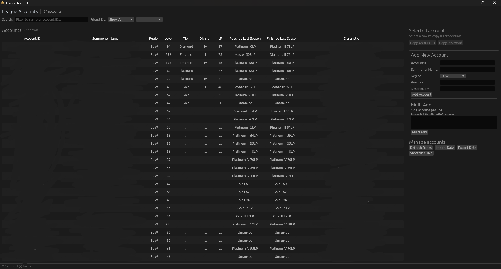

# LeagueAccounts

**LeagueAccounts** helps you manage multiple **League of Legends** accounts from one Windows app, with secure password storage, quick login helpers, and automatic rank updates. The application is implemented in Rust and ships as a native Windows desktop executable.



## Features

- **Quick Account Switching**: Keep all accounts in one list, searchable by account ID or summoner name.
- **Secure Password Storage**: Store credentials with Windows Credential Manager; the local account file never contains passwords.
- **Auto Credential Entry**: Click **Login (auto-type)** or press `CTRL+SHIFT+V` to switch back to the previous window and fill Riot Client login fields.
- **Automatic Rank Updates**: Fetch current rank, last-season peak/finished ranks, and level from OP.GG in parallel.
- **Import / Export**: Move account data between installs as JSON (exports include passwords by explicit request).
- **Friend Elo filtering**: Show accounts compatible with a selected tier and division.
- **Inline editing**: Double-click a summoner name or description to edit it.
- **Private diagnostic logs**: Plain-text support logs with no account data or passwords.

## Installation

[Download the latest release](https://github.com/FlorentTariolle/LeagueAccounts/releases/latest).

## Building and running from source

```bash
# Run the native app
cargo run --release

# Build the Windows executable
cargo build --release
```

The executable is written to `target/release/LeagueAccounts.exe`. Account data is stored at `%APPDATA%\\LeagueAccounts\\league_accounts.json`; passwords are stored in the native Windows Credential Manager under the `LeagueAccounts` service.

## Keyboard shortcuts

- `Ctrl+C`: copy the selected account ID; press again for its password.
- `Ctrl+Shift+V`: auto-type the selected account ID and password in the previous window.
- `Delete`: delete the selected account.
- Double-click a summoner name or description to edit it.

## Reporting an error

Click **Open Logs Folder** in the app, or open `%APPDATA%\LeagueAccounts\logs`
in Windows Explorer. Reproduce the problem, then inspect and send the newest
`.log` files with your bug report. Logs are ordinary, unencrypted UTF-8 text;
nothing is uploaded automatically. Share the files in the `logs` folder only.

Each line contains a UTC Unix timestamp in milliseconds (`unix_ms`), severity,
a fixed event code, a fixed failure category, app version, operating system,
and CPU architecture. For example, a rank request rejected by OP.GG can record
`event=rank_fetch_failed reason=http_rate_limited`.

The logging API accepts only predefined enums. It cannot accept account IDs,
passwords, summoner names, descriptions, clipboard content, imported/exported
JSON, file paths, URLs, HTTP bodies, or raw error messages. Panic messages,
backtraces, and dependency logs are also excluded because they can contain
sensitive data. Failures are classified without formatting their underlying
errors. This intentionally limits diagnostic detail to protect credentials.

A new log starts each time the app opens. Files rotate at 1 MiB, and the newest
20 log files are retained (up to roughly 20 MiB; files locked by another running
instance may remain until a later cleanup). If writing fails, the status bar
shows **File logging unavailable** and the app continues working. Rust panics
are logged as a generic event; forceful termination or native crashes may leave
no final event.
